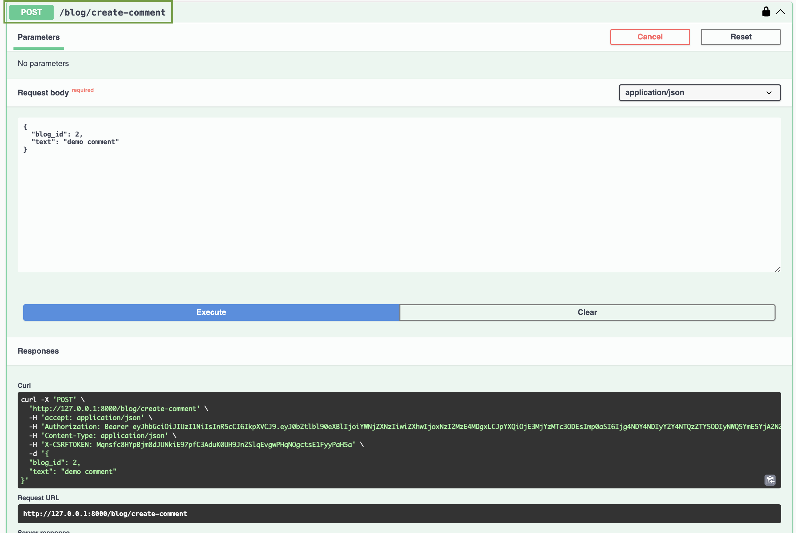

## Tasks and Implementation

### Task 1: Add `enabled` Field to Blog Model
Add a boolean field to make blog posts published or unpublished.
- **Implementation Details**: Added an `enabled` field to the Blog model to manage post visibility and ran `makemigrations` and `migrate` commands.
- **Screenshot**: 

### Task 2: Display Blog Name and Status in Django Admin
Display the real blog name and enabled/disabled status in the Django Admin.
- **Implementation Details**: Accesed the Django Admin to show the blog's name and status (enabled/disabled) by accessing the `/admin` section.
- **Screenshot**: 

### Task 3: Create Blog Post Endpoint
Develop an endpoint to create new blog posts.
- **Implementation Details**: Created `BlogCreatePost` view using Django REST Framework to handle creating new blog posts, and added it to the URL patterns.
- **Screenshot**: 

### Task 4: Create Comments Model
Create a Comments model to associate comments with blog posts.
- **Implementation Details**: Added a `Comments` model with `text` to store comment content and a `ForeignKey` to link each comment to a blog post. Ran migrations to update the database.
- **Screenshot**: 

### Task 5: Add Comments Management in Django Admin
Enable comment management in the Django Admin.
- **Implementation Details**: Registered the `Comments` model in Django Admin to manage comments easily from the admin interface.
- **Screenshot**: 

### Task 6: Create Comment Endpoint
Create an endpoint to add comments to a blog post.
- **Implementation Details**: Created `CommentsSerializer` to validate and handle comment creation, and `CommentsCreateView` to manage comment submissions. Added the new endpoint to the URL patterns.
- **Screenshot1**: 
- **Screenshot2**: 

### Task 7: Return Blog Post and Comments
Modify the `/blog/blog/{id}` endpoint to return the blog post along with its comments.
- **Implementation Details**: Added a `comments` field in the `BlogSerializer` to include related comments when returning a blog post.
- **Screenshot1**: 
- **Screenshot2**: 
